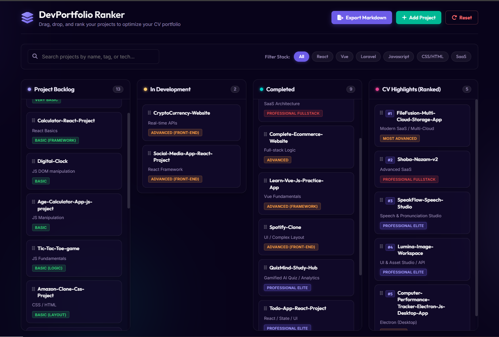
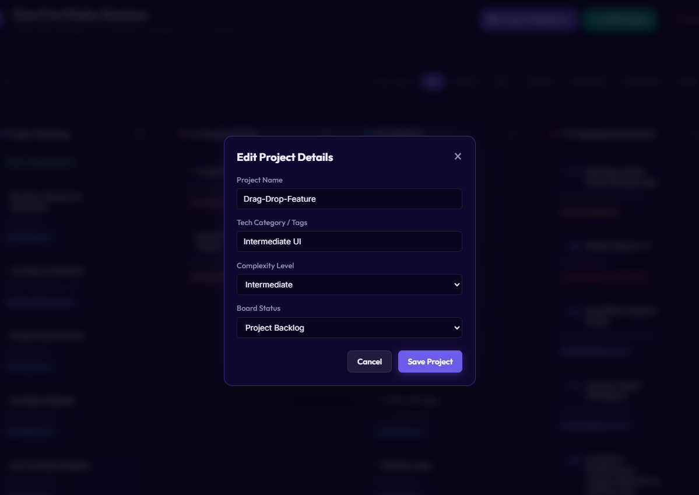
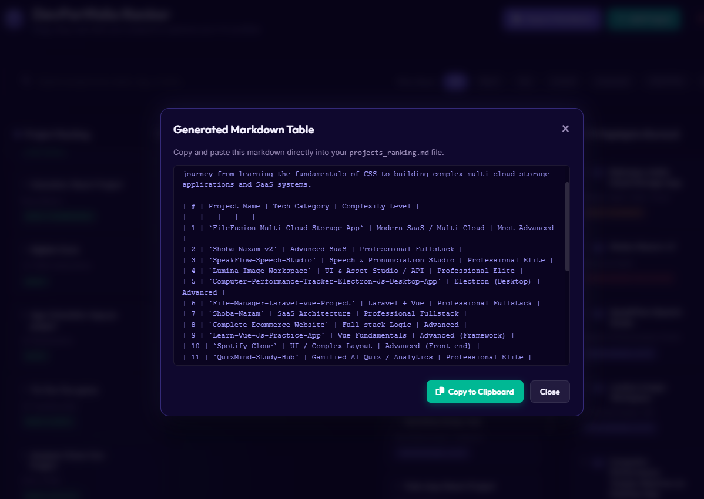

# DevPortfolio Ranker 🚀

DevPortfolio Ranker is a premium, interactive web application that helps developers visually organize, rank, and track their personal projects to optimize their portfolios and CVs. Built using a modern glassmorphic interface and vanilla CSS, it allows developers to drag, drop, and structure projects into logical pipeline columns.

## 📸 Interface Preview

### Core Dashboard
The main dashboard displays your projects organized by status columns. Each card highlights the tech category and complexity level, featuring dynamic rank indicators in the CV Highlights list.

---

## 🌟 Key Features

*   **Stateful HTML5 Drag-and-Drop**: Easily move project cards between columns and rearrange cards vertically to custom-rank projects by priority or complexity.
*   **Persistent Layouts**: All column updates, rankings, and custom modifications are automatically saved using the browser's `localStorage` and persist through refreshes.
*   **Search & Stack Filtering**: Dynamically filter project cards in real-time by name, tag, or tech categories (e.g., React, Vue, Laravel, SaaS) using the search bar and filter chips.
*   **Dynamic Modals**:
    *   **Edit Project Details**: Customize descriptions, tech stack, and difficulty ratings on the fly.
    *   **Add Custom Projects**: Easily expand your list with new items.
*   **Markdown Generator**: Instantly generate a clean Markdown table representation of your current rankings, perfectly structured to copy-paste back into tracking files like `projects_ranking.md`.

---

## 🛠️ Deep Dive into Functionality

### 1. Card Customization & Metadata
Clicking the edit icon on any card opens a custom form overlay to update project titles, categories, complexity classes, and workflow columns.

### 2. Live Markdown Table Exporter
Generate document-ready markdown tables that align directly with your projects ranking spreadsheet or repository documentation.

---

## 📁 File Structure

The project has a lightweight, modular foundation:
*   [`index.html`](index.html): Defines the dashboard grid columns, options panel, headers, and modal wrappers.
*   [`style.css`](style.css): Powers the premium dark glassmorphism styling, glowing background lighting, badging systems, and card active states.
*   [`script.js`](script.js): Manages list sorting calculations, state transitions, event delegates, and data serialization.

---

## 🚀 How to Run Locally

1.  Clone or download this repository.
2.  Open [`index.html`](index.html) in any modern web browser.
3.  *Optional*: Use a local development server (e.g., Live Server extension in VS Code) for live editing.
